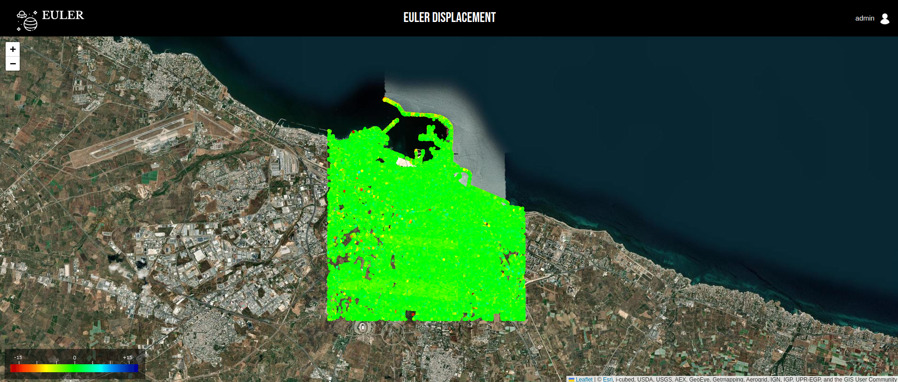
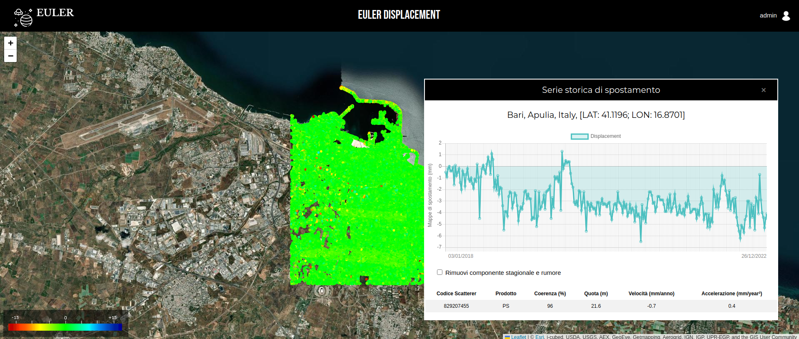
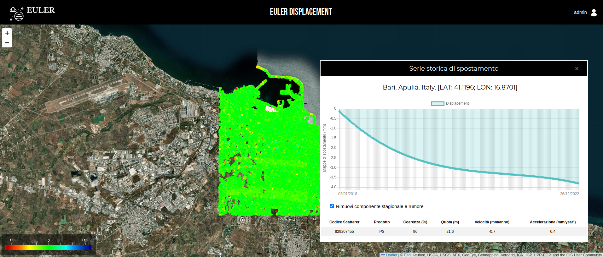

# EULER DISPLACEMENT

**Project for the Bachelor's Thesis in Computer Science**  
Julian Pajo  
University of Aldo Moro, Bari  
July 17, 2024  

**Title:**
Orchestration of a Docker Swarm for Monitoring and Seasonal Analysis of Persistent Scatterers Displacement

This project represents a study on how to define and orchestrate services for monitoring soil displacement using Persistent Scatterers and conducting a seasonal analysis of them.

Persistent Scatterers are stable radar reflectors on the ground that consistently return strong radar signals over time. They are used in satellite radar interferometry to monitor and measure very slight movements of the Earth's surface, which can be crucial for detecting and understanding ground subsidence, infrastructure stability, and other geological phenomena.

**Setting Up the System:**
To set up the system, follow the subsequent tutorial [here](./docs/DEPLOY.md).

### Access Euler Displacement

After setting up the system, you can access the Euler Displacement service by navigating to:

**https://displacement.euler.local**

Log in using the credentials:
- **Username**: admin
- **Password**: pass123

 

Upon login, you will be presented with the interface displaying the map of Bari with the persistent scatterers.

 

 

You can then query the Persistent Scatterers (PS) by clicking on them to obtain information and observe their displacement over the years.

 

 

By applying the filter, you can view the trend of the PS filtered from the seasonal component and noise, allowing you to observe the natural behavior of the PS.

 

